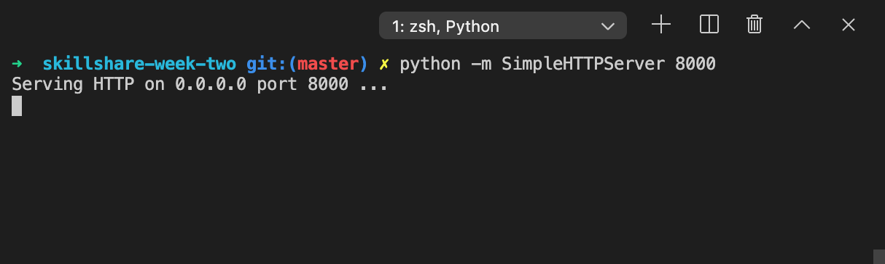
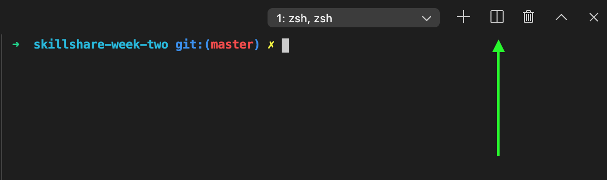
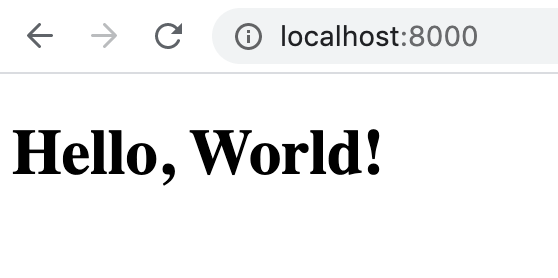
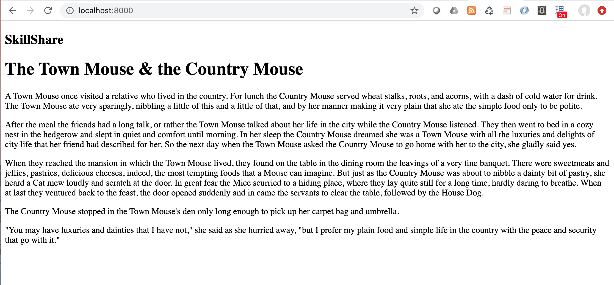
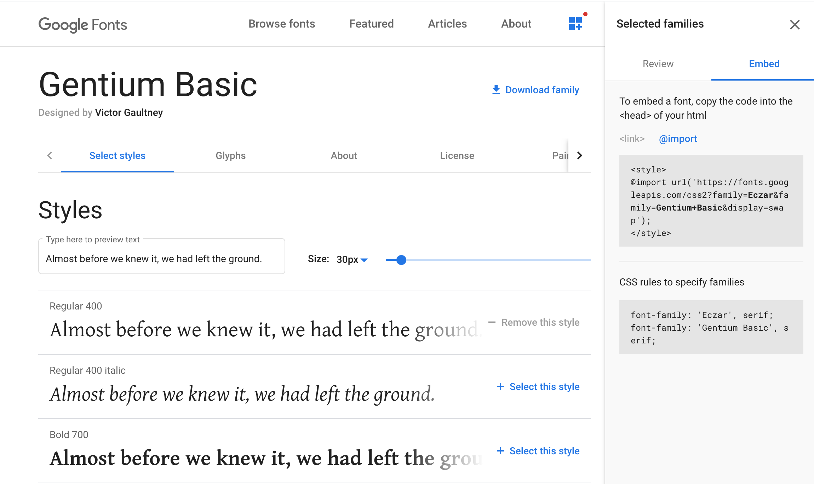

# Week One

## Goals

1. Install Homebrew, Git and VSCode (we'll only be using the last of these for this tutorial).
2. Become familiar with using the Terminal to create files and navigate through directories.
3. Become familiar with the basics of HTML and CSS by creating a static blog style webpage.

There is quite a lot to cover here so if we spend two weeks going over it that's fine!

***

## Setup

This week we're going to begin learning the basics of HTML and CSS, but first we need to install three applications.

### Homebrew

First, let's install Homebrew. Homebrew is a package manager for macOS.

Open your terminal and paste in `/bin/bash -c "$(curl -fsSL https://raw.githubusercontent.com/Homebrew/install/master/install.sh)"`.

### Git

Next, we need to setup your Git account. Go to `https://github.com/join` and setup an account.

Install Git through Homebrew and configure your credentials.

### VSCode

Next, we need to install a text editor. I recommend using VSCode, but you could also use Sublime Text or Atom if you prefer. I prefer VSCode because it has a terminal integrated into the application which is useful if you only have one display to work with (when it comes to working with shell or looking through server logs you'll want a second display just for the terminal).

To install VSCode, head to `https://code.visualstudio.com/docs/setup/mac`.


***

## Task

We're going to setup a static web page that displays the first few paragraphs of Franz Kafka's Metamorphosis. We'll add a few paragraphs and images. Feel free to choose your own sample text and images.

The idea here is to get familiar with the structure of HTML and CSS.

### Terminal

Open VSCode from your applications folder. Go to _Terminal_ and click _New Terminal_.

Though it may be a little intimidating at first, using Terminal will massively speed up your development and you'll become more comfortable with it the more time you spend using it.

The following commands will come in handy:

| Command | Meaning |
| ------- | ------- |
| `pwd`   | Print working directory, i.e. prints the name of the directory you're in. |
| `ls`    | Returns a list of directories and files in the current directory |
| `cd`    | Change directory. Type `cd` followed by a space and the directory you want to move into, e.g. `cd app` . Use `cd .. ` to navigate back to the immediately preceding directory. |
| `mkdir` | Make directory. Type `mkdir` followed by a space and the name of the directory you want to make. e.g. `mkdir workspace` |
| `touch` | Creates a file. Type `touch` followed by the name of the file you want to create. Be sure to include the filetype e.g. `index.html` rather than `index`. |
| `rm` | Deletes a file. Type `rm` followed by space and the file you want to delete, e.g. `rm index.html`.
| `rmdir` | Deletes a directory. Type `rmdir` followed by space and the directory you want to delete, .e.g `rmdir styles` |
| `pwd` | Print working directory. Prints the directory you're in. |


***


## Let's begin!

Select Terminal in the menu in VSCode and select New Terminal to open a new terminal window. If you type `pwd` you should be in `/Users/<username>`, where `<username>` is the name of the account on your computer.

Enter `mkdir <directory name>` to create a new directory, e.g. `mkdir skillshare`.
Move to the directory you've just created by typing `cd <directory name>`, e.g. `cd skillshare`.

Since we'll be going through different topics week by week, it's a good idea to create directories for each week, so go ahead and type `mkdir week-one` and `cd` into that directory with `cd week-one`.

If you type `pwd` again you should see something like `/Users/<username>/skillshare/week-one`.

First, you'll want to create our index HTML page, so go ahead and type `touch index.html`.


### Viewing your document

You have one of two options for viewing your HTML page in Chrome (or any other browser).

1. Open your browser and go to File > Open file. Navigate to the HTML file you want to view and open.

2. Setup a local server **(Recommended)**. Your Mac should have both PHP and Python 2.x installed. For PHP enter `php -S localhost:8000`. For Python enter `python -m SimpleHTTPServer 8000`. Both will start a HTTP server on port 8000. 

You should see the following in your Terminal window:



Now open up a browser tab and enter `localhost:8000` into the search bar. When you enter this command, the script will look for a file named either `index.html` or `index.htm` so make sure your HTML file is named correctly!

You might want to split your Terminal window to allow you to run the local server and continue to create files and move between directories, so click the Split Terminal icon to open another Terminal.




Let's make a basic _Hello, World!_ page to make sure everything is working correctly (FYI displaying _Hello, World!_ is usually the first thing you learn when learning _any_ new language).


Let's go back to our `index.html` page. Open it up in VSCode and enter the following code:


```
<!DOCTYPE html>
<html lang="en">
    <head>
        <meta charset="utf-8">
        <title>Hello, World!</title>
    </head>
    <body>
        <h1>Hello, World!</h1>
    </body>
</html>
```

Now when you refresh your browser and you should see the following:




Let's dissect the code above to understand what's going on.

### Document type

The first line `<!DOCTYPE html>` is called a document type declaration. It's unlikely we'll need to look at any other document type (e.g. XML) during this Skillshare, so it should be sufficient to just remember we need to include this as the first line of the HTML document.

The next line `<html lang="en">` is the root element of the document. The `lang="en"` attribute declares that the document is in English (important for accessibility).


### Head

Next, we see the `head` element. This element contains all the metadata related to a document (essentially data that isn't displayed when a user opens their browser).

#### Meta tags

There is a broad range of metadata we may need to add to the `head` element. Examples include:

- `charset` which tells the browser which character encoding the document uses. `utf-8` supports pretty much any language we'll need so it's unlikely we'll need to use another character set.

- Keywords metadata (how search engines would find your page ~20 years ago). `<meta name="keywords" content="Skillshare, Skill, Share, HTML, CSS">`. For various reasons (e.g. keyword stuffing), this is rarely used and not recommended.

- Images and description that's displayed when a user posts your site in a tweet on Twitter. `<meta name="twitter:card" content="summary"></meta>`

### Title

The head is also where we declare the document title. The document title will appear in the browser tab and if a user saves the webpage in their bookmarks.

It's also possible to set the document title dynamically but we'll cover that later.

### External files

The `head` element is also where we will link to our CSS document:

`<link rel="stylesheet" href="styles.css">`

The `rel` attribute denotes the relationship of the link to the document whereas `href` or _hypertext reference_ specifies the location of the resource (e.g. stylesheet, icon, document).

You'll use similar markup to declare your favicon:

`<link rel="shortcut icon" href="/favicon.ico">`

If we were including JavaScript, the `head` would also be where we would include a link to our scripts `<script src="index.js">`, but more of that later.


### Body


You may have noticed that each element in the code has both an opening `<>` tag and a closing `</>` tag. The tags appearing beneath (and helpfully indented by most text editors) are contained within the preceding element.

A word on terminology here:

- Tag: `<p>`
- Element: `<p></p>`

Some elements do not require closing tags and are called _empty elements_, e.g. a line break `<br>` or an image ``.


Now that we've covered the basics, let's get on with building our first web page.

***

Add image of the site we want to create.

## HTML

Let's setup our blog page. I'm using the fable _The Town Mouse & the Country Mouse_ by Aesop for the text but you can use anything you like. If you want to use the text I used, you can copy and paste it from the `story.txt` file in the current repository.

First things first, let's add our title to our `title` element.

```
<title>The Town Mouse & the Country Mouse</title>
```

First, we need to make sure we're using the correct tags for our content.

### Semantic and generic elements

We'll use the following elements in our page:
- `div`
- `article`
- `section`
- `main`
- `header`
- `footer`
- `h1`
- `h2`
- `p`
- `span`
- `img`

These tags can be split into roughly two groups: _semantic_ and _generic_.

Semantic elements are useful for SEO and in assisting users with impaired visibility to use your page. The elements tell screen readers and search engines what the purpose of the element is.

Some of the semantic elements will be fairly self-intuitive, i.e. `header` should be at the top of the page, `nav` is the navigation bar, and `footer` should sit at the bottom of the page.

Used pretty flexibily.

### Structure

Let's begin setting out the basic structure of our page.

```
<div class="container">
    <header>
    </header>
    <main>
        <article>
        </article>
    </main>
    <footer>
    </footer>
</div> 
```

First, we put all our content in a `div` with the class `container`. This will allow us later to centre all of the content contained within the `div` element. `div`s are generic elements. In fact, we really don't need to use the semantic tags to build our page but it's good practice to do so.

The `header` is the container for things like site logo, `nav` navigation menu, contact details, social media links etc. Given that we're building a single page, we won't add much to our `header`.

`main` should contain the body of the page and there should only be one `main` per page.

`article` is a self-contained piece of content that could sit entirely on its own (think of a news story).

`footer` can contain things like contact details, secondary navigation and usually contains things like privacy policy, legal notice etc.

Notice that we haven't added any text at all to our page yet semantically it still has an identifiable structure.

Let's go ahead and begin adding content to our elements.

### Headings

First, let's add a logo to our `header`. Add between your `header` tags:

```
<h2>SkillShare</h2>
```

We're using a `h2` heading here rather than `h1` because there can only be one `h1` heading (for SEO reasons). Let's also add `site-logo` as a class to the `h2` heading here so we're able to style it directly and also because we may want to use a `h2` with different styling elsewhere.

```
<h2 class="site-logo">SkillShare</h2>
```

Because our site is only going to have one article in it, we're free to use a `h1` class as the title of our `article`. If we expected to have muliple articles on the page, we should use a `h2` or `h3` heading.

Let's add the `h1` element like so:

```
<article>
    <h1>The Town Mouse & the Country Mouse</h1>
</article>
```

Next, let's add our text paragraphs after our heading. Each paragraph needs to be between `<p></p>` tags, so add each paragraph like so:

```
<p>
    A Town Mouse once visited a relative who lived in the country...
</p>
```

Once you're done adding all the paragraphs, load the local server and navigate to your page. You'll notice the content sprawls across the width of the browser with no structure.





There are still a few elements we can add here (e.g. images) but for now, let's begin adding CSS.


## CSS

First, some background
CSS stands for _cascading style sheets_. Meaning - 

Prior to CSS, `table` elements were used to structure HTML documents and on rare occasions you can still see tables used in this way (if you see a site the looks like it came out the late 90s, open up the developer console and check!).

CSS uses a different syntax from HTML.
Propety + syntax
Selector + declaration block

There are three ways of adding style to an element.

- Inline - style is added as an attribute to a tag, e.g. `<p style="color: red;>"`.
- Embedded - style is added between `style` tags in the header, e.g. `<style> p { color: red; }</style>`.
- External - styles added in a separate sheet and referred to using the `link` tag, e.g. `p { color: red; }`.

Generally speaking, you should never use inline styles because it's too difficult to maintain. I'd also recommending avoiding embedded styles unless you're working on a very small proof of concept and need to save time. You'll find it easier and cleaner to contain all your styles in a different sheet, so that's what we'll do here.


### IDs and Classes

In order to select a single element, use an ID. The ID is added to the individual HTML element you wish to select. As a rule, an ID should only be used once on the page.

ID is added as an attribute to the opening tag and selected from CSS:

#### HTML
```
<h1 id="page-title">
```
#### CSS
```
#page-title {
    margin: 5px;
}
```

Best practice dictates that we include the element type when selecting the element in CSS. This will make it easier to identify which element you're referring to when editing your CSS later.

```
h1#page-title{
    margin: 5px;
}
```

Alternatively, if you expect to use an element more than once on the same page, use a class.

#### HTML
```
<p class="body-text">
```

#### CSS
```
.body-text {
    font-size: 12px;
}
```

As with IDs, we can skip the element name but it's good practice to include it.

```
p.body-text {
    font-size: 12px;
}
```

Now with that out the way, let's style our first element.

We'll start with the `div.container`. There are two things we need to do here. First, we want to centre our content and we do that by setting the top and bottom margins of `div.container` to `0` and the left and right margins to `auto`.

Reload your browser and you should see the content appears in the centre.


### Working with Webfonts

You'll notice that the browser default to showing our text in Times New Roman. Times New Roman, like Arial, Courier are what are called _web safe fonts_ meaning they're pre-installed on most devices.

However, we can now use web fonts from third parties like Google Fonts or Adobe Typekit.

There are a number of options for including web fonts.
- Add the `ttf` or `otf` font files to your local directory and reference them from your CSS.
- Link to the CSS file of the font.
- (Preferred) include an `@import` in your stylesheet and import the front directly from Google Fonts (or Adobe Typekit).

Go over to Google Fonts and find a good font pairing for your site. I chose Eczar for my headings and Gentium Basic for my body text. Click _download fonts_, select _embed_, and  _@import_. Copy the CSS from between the `<style>` tags and paste it into the top of your `index.css` stylesheet.

```
@import url('https://fonts.googleapis.com/css2?family=Eczar&family=Gentium+Basic&display=swap');
```




The next thing we need to do is determine which elements should use which fonts by using the `font-family` attribute. You _can_ declare it in the body tag, but I prefer to declare the elements individually.

```
p {
    font-family: 'Gentium Basic';
}
```

We also need want to use Eczar for both our headings tags. To select multiple elements, we declare both of the element names separated by a comma:

```
h1, h2 {
    font-family: 'Eczar';
}
```

The comma here is very important. Without the comma, the selection `h1 h2 { ... }` means a `h2` element that is contained within a `h1` element. 

So far, your `index.css` file should look like this:

```
@import url('https://fonts.googleapis.com/css2?family=Eczar&family=Gentium+Basic&display=swap');

div.container {
    width: 768px;
    margin: 0 auto;
}

h1, h2 {
    font-family: 'Eczar';
}

p {
    font-family: 'Gentium Basic';
}
```

Reload your browser. Looks better already, no?

#### Font stacks

Though most browsers should have no problem rendering your web font as you intended, it's still good practice to declare fallback fonts. These are fonts that are similar to your chosen font and are declared in order.

```
h1, h2 {
    font-family: 'Eczar', 'Times New Roman', serif;
}
```

What this means is that if the browser fails to render the first font declared, it will try the next. If it can't find that system font, it will try the next, and so on until it finds `serif` or `sans-serif`. This is known as _graceful degradation_.


For readability the maximum number of characters on a line is 65. Let's change our font size to make the text more presentable. To change font-size, use the `font-size` attribute. We're going declare are font-size attribute in pixels, but you can also use ems, percentages, absolute size values (e.g. `large`) or relative size values (i.e. relative to the parent element e.g. `larger`).

#### Typescale

I like to use the typescale calculator at https://type-scale.com/ and set my heading sizes relative to the body font size. I set my base size as 24px, h2 as 37.5px and h1 as 46.88px.

Declare your font sizes like so:

```
p {
    font-family: 'Gentium Basic';
    font-size: 24px;
}

h1 {

    font-size: 37.5px;
}

h2 {
    font-size: 30px;
}
```

You'll notice our paragraphs look a little tight, so add a `line-height` attribute to space each line.

```
p {
    font-family: 'Gentium Basic';
    font-size: 24px;
    line-height: 36px;
}
```

### Images


### Working with Frameworks

Bootstrap.
Ionic.

Positives, negatives.


---

## Stretch goal

1. Create a design for a page in Figma and try to recreate it in HTML and CSS.
2. Check your design across different browsers. Does the design look the same across all browsers? If not, how might you fix it?